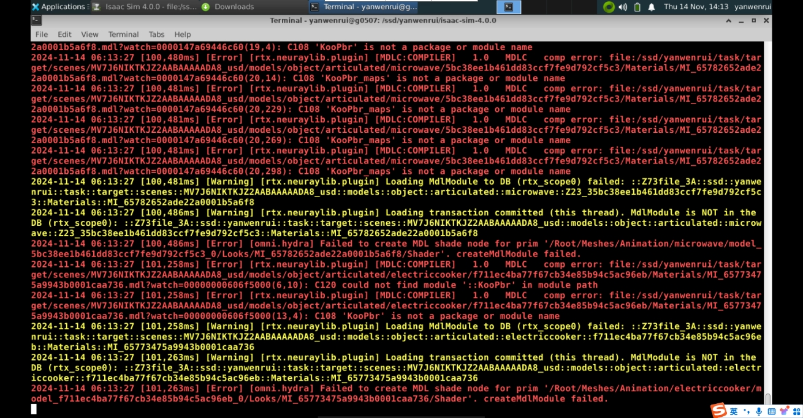
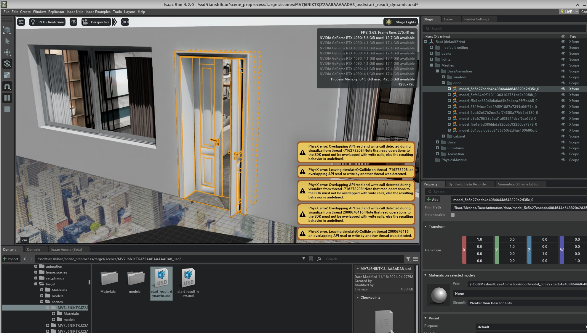

# MDL 包缺失：`MDLC COMP ERROR` / 找不到 `KooPbr` 与 `KooPbr_maps`

## 问题现象
在加载处理好的场景（例如 `start_new_dynamic.usd`）时控制台大量刷出类似：
```
[Error] [rtx.neuraylib.plugin] [MDLC:COMPILER] 1.0 MDLC comp error: ... KooPbr_maps is not a package or module name
[Error] [rtx.neuraylib.plugin] [MDLC:COMPILER] 1.0 MDLC comp error: ... KooPbr is not a package or module name
[Warning] [rtx.neuraylib.plugin] Loading MdlModule to DB (...) failed
[Error]   [omni.hydra] Failed to create MDL shade node for prim ... _createdMdlModule failed.
```
结果：
- 场景中大量材质丢失 / 物体变灰或默认色。
- 后续点击仿真可能卡住甚至崩溃（材质系统频繁重试 / 资源未就绪）。

控制台报错截图（图 1）：


UI 中对象（例如门、家电等）材质缺失（图 2）：


> 注：若当前仓库还没有这两张图片，请将截图保存为 `images/mdl-error-console.png` 与 `images/mdl-ui-door-warnings.png` 后重新查看文档。

## 原因分析
Isaac Sim 渲染使用 MDL (Material Definition Language) 模块系统。加载 USD 时：
1. 解析每个材质的 MDL 引用，如：`KooPbr::material()` 或 `KooPbr_maps::xxx`。
2. 通过 MDL 搜索路径列表（环境变量 + Kit 设置）定位 `.mdl` 包或目录。
3. 调用 MDLC 编译生成可执行 shader。

本问题发生时：
- 目标机器缺少所需的 MDL 包目录（例如同事环境中存在的第三方/自建材质库未同步）。
- 或未正确设置 `MDL_SYSTEM_PATH` / 启动参数 `--/rtx/mdl/searchPaths+=`。
- 导致编译器在系统路径中无法找到 `KooPbr` 与 `KooPbr_maps`，每个引用点都产生一次编译失败日志 → 屏幕被刷满。

二级影响：
- 未编译成功的材质被替换为默认 fallback，后续渲染/仿真阶段逻辑（例如基于材质的传感器、光照缓存）可能失效或延迟。

## 验证缺失的方式
| 方法 | 操作 | 预期 / 说明 |
|------|------|-------------|
| 环境变量检查 | `echo $MDL_SYSTEM_PATH` (Linux) 或 `echo %MDL_SYSTEM_PATH%` (Win) | 不包含需要的目录时需补充 |
| 搜索包名 | 在材质库根目录 `grep -R "KooPbr"` | 找不到说明确实未同步 |
| 启动参数 | 查看启动脚本是否包含 `--/rtx/mdl/searchPaths+=` | 未指定则只依赖系统默认路径 |
| GUI 中材质浏览器 | 打开 MDL Browser | 无该包出现表示路径未被索引 |

## 解决方法
### 方法一：同步缺失的 MDL 包
1. 在一台“正常”机器上找到材质包目录（示例）：
   - `/data/envs/mdl/KooPbr/` 与 `/data/envs/mdl/KooPbr_maps/`
2. 打包拷贝到目标机器，例如放在：`~/mdl/`（Linux）或 `D:\mdl\`（Windows）。

### 方法二：配置 MDL 搜索路径
可选方式 A（环境变量，跨会话）：
```bash
# Linux ~/.bashrc
export MDL_SYSTEM_PATH="$MDL_SYSTEM_PATH:$HOME/mdl"
```
```powershell
# Windows PowerShell (当前会话测试)
$env:MDL_SYSTEM_PATH = "$env:MDL_SYSTEM_PATH;D:\mdl"
```
方式 B（Isaac Sim 启动参数）：
```
./isaac-sim.sh --/rtx/mdl/searchPaths+="/home/user/mdl"
```
方式 C（在 Kit 交互控制台 Python 设置运行时路径）：
```python
from omni.kit.app import get_app
mdl_iface = get_app().get_mdl_interface()
mdl_iface.add_mdl_search_path("/home/user/mdl")
```

### 方法三：统一分发策略
编写一个启动前检查脚本：
```bash
REQUIRED=(KooPbr KooPbr_maps)
BASE=$HOME/mdl
for pkg in "${REQUIRED[@]}"; do
  if [ ! -d "$BASE/$pkg" ]; then
     echo "[MISS] $pkg"; MISSING=1
  fi
done
if [ "$MISSING" = 1 ]; then
  echo "Missing MDL packages. Abort."; exit 1
fi
```

### 方法四：最小化复现 / 清缓存
若拷贝后仍报错：
1. 清理旧 shader / MDL 缓存：
   - Linux: `rm -rf ~/.cache/ov/*mdl*` (谨慎)  
2. 重启再加载同一 USD，确认是否消失。

### 方法五：临时降噪（不推荐长期）
在未及时同步包时，可先将引用这些材质的对象设置为简单 PBR 或移除自定义材质以保证仿真流程，不过应尽快补齐材质库，以免渲染/传感器表现失真。

## 深入排查（可选）
若不确定哪些 Prim 引用了缺失材质，可在 Python 中：
```python
from pxr import Usd, UsdShade
stage = Usd.Stage.Open('start_new_dynamic.usd')
missing = set()
for prim in stage.Traverse():
    if prim.GetTypeName() == 'Material':
        src = prim.GetAttribute('info:mdl:source')
        if src and src.Get() and ('KooPbr' in src.Get() or 'KooPbr_maps' in src.Get()):
            missing.add(src.Get())
print('Referenced MDL modules:', missing)
```

## 验证与回归
| 验证项 | 期望 |
|--------|------|
| 启动日志 | 无新的 `MDLC comp error` 与 `not a package or module name` |
| 材质显示 | 原有对象恢复到预期外观（不再统一灰/粉） |
| 再次重复启动 | 多次重启仍无报错，说明路径永久生效 |
| 仿真启动 | 不再因材质模块加载失败卡住 |

## FAQ
**Q: 直接把包放到 USD 同目录可行吗？** 可以，但仍需保证该目录位于搜索路径；集中放置更利于运维。

**Q: 是否可以把材质 bake 成纹理绕过 MDL？** 仅对静态 / 简单光照场景可考虑，实时材质交互能力下降。

**Q: 多版本 Isaac Sim 是否共用一个 MDL_SYSTEM_PATH?** 可以，但注意包内部若有版本条件宏可能导致兼容性差异。

## 参考资料
- NVIDIA MDL 介绍与开发文档
- Isaac Sim 文档：Material / MDL 搜索路径配置章节
- 本仓库：材质缺失 / 粉色显示 问题条目

> 总结：本问题本质是“材质引用指向的 MDL 包不在当前搜索路径集合”。补齐包 + 正确配置 MDL_SYSTEM_PATH（或启动参数）即可根治。
